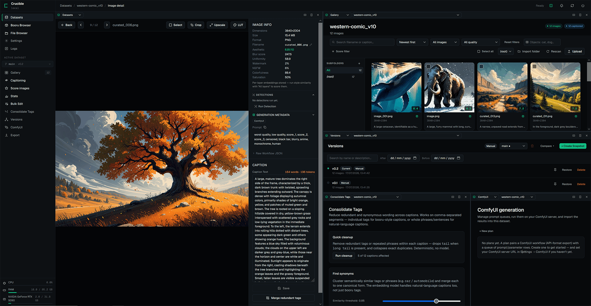

<p align="center">
  
</p>

# Crucible

Crucible is a local dataset engineering platform for AI image training. Instead of juggling folders, captioning scripts, scoring tools, duplicate finders, and export scripts, it brings the entire dataset workflow into one application.

**Import or Generate → Organize → Caption → Score & Curate → Refine → Version → Export**




▶ [Watch the showcase on YouTube](https://www.youtube.com/watch?v=Ig4j5ijovCI)

---

## Workflow

Every step from raw images to a training-ready export, in order:

1. **Import or Generate** — pull images from local folders (with subfolder organization, an optional native "Browse…" picker, and `.txt` caption sidecars), or browse your filesystem and import directly; source and license are captured as you import — typed into the import dialog, or read from scraper sidecars and EXIF → [details](docs/gallery.md), [provenance](docs/provenance.md) — or generate them from scratch by queueing prompts against your own ComfyUI workflow → [details](docs/comfyui.md) — or add videos as sources and extract frames from them, shot by shot → [details](docs/video.md)
2. **Organize** — group datasets into named categories; drag onto a category sidebar or section to reassign, and switch between card and compact-row density → [details](docs/gallery.md)
3. **Caption** — batch-caption with local ML models (Florence-2, PaliGemma-2, JoyCaption, WD14, Ollama) or any OpenAI-compatible API → [details](docs/captioning.md)
4. **Score & Curate** — score every image across aesthetic, technical, watermark, NSFW, and style-similarity metrics, then filter by search, quality flags, score ranges, and detected object labels → [details](docs/scoring.md)
5. **Refine** — consolidate tags, batch-edit captions/crops/resizes, upscale, LUT color grade, detect & segment objects, and reorder manually → [details](docs/editing.md)
6. **Version** — capture named snapshots and branches, and restore any prior state → [details](docs/versioning.md)
7. **Export** — output to Kohya, AI Toolkit, or plain folder format — ready to train Stable Diffusion, SDXL, Flux, and more — with per-export filtering, resizing, and `CREDITS.md` / `licenses.csv` attribution manifests → [details](docs/export.md)

---

## Features

### Dataset management
- **Organize** datasets into named categories, browsed from a category sidebar or collapsible sections, in card or compact-row density → [details](docs/gallery.md)
- **Import** images from local folders into named datasets with subfolder organization, an optional native "Browse…" folder picker, and optional import of `.txt` caption sidecars → [details](docs/gallery.md)
- **Sync** a dataset with its folder on disk — rescan to register images and pick up `.txt` captions added outside the app, import captions from a folder, or auto-rescan on open → [details](docs/gallery.md)
- **Hold videos** alongside a dataset's images as sources for frame extraction — stored and counted separately, browsable in a strip above the image grid with poster frames, an inline player, rename, and delete from the strip or the video's own page (experimental). A codec the browser cannot play says so plainly instead of claiming the file is corrupt — extraction reads the file directly and is unaffected → [details](docs/video.md)
- **Extract frames** from one video or several at once — preview the clip, drag a crop over a letterbox matte, trim the head and tail, then cut one or more frames per detected shot into a subfolder of ordinary images you can score, caption and export. A **Frames from** gallery filter finds everything one video produced however far curation has since moved it, and the technical scorer's **brightness** metric separates the usable frames from the fades to black → [details](docs/video.md)
- **Re-extract the keepers at full resolution** once you have curated the small triage frames — Crucible seeks back to the exact moment each frame came from and cuts it again from the original video, replaying the same crop and deinterlacer, as JPEG or lossless PNG. Frames edited in place since are skipped rather than silently overwritten → [details](docs/video.md)

### Image generation
- **Generate** images into a dataset by queueing prompts against your own ComfyUI workflow — pin the parameters you want to vary, build a queue of prompts (write them by hand, import them, or generate them with an LLM), and every output is imported automatically with metadata and optional captions → [details](docs/comfyui.md)
- **Reuse prompts** from a global prompt library shared across every dataset and plan → [details](docs/comfyui.md)

### Captioning
- **Caption** images in batch using local ML models (Florence-2, PaliGemma-2, JoyCaption, WD14, Ollama) or any OpenAI-compatible API — or drag a `.txt` file onto an image to set its caption → [details](docs/captioning.md)

### Quality & curation
- **Score** every image across aesthetic, technical, watermark, NSFW, and style similarity metrics — aesthetic scoring offers a choice of two models (LAION over CLIP, or Aesthetic Predictor V2.5 over SigLIP), and records which one produced each score. Style similarity reads as a **percentile** on every gallery card and on the image detail page, since the raw cosine's scale depends on which embedding model produced it → [details](docs/scoring.md)
- **Filter & curate** via search, quality flags, score ranges, and detected object labels → [details](docs/gallery.md)

### Object detection
- **Detect** objects with Florence-2 bounding-box detection, NudeNet body-part detection, Grounded SAM 2.1 (SAM2 + Grounding DINO) segmentation masks with text or point prompts, or SAM 3 open-vocabulary text-prompt segmentation (SAM/Grounded text prompts accept several comma-separated phrases in one run); detection runs in the background so you can queue several runs at once → [details](docs/detection.md)
- **Manage detections** — rename, delete, merge, hand-draw new boxes (optionally SAM-segmented), and point-refine masks per image; run or bulk-delete detections by label/model/score across the dataset from the Bulk Edit page → [details](docs/detection.md#managing-detections)
- **Crop to detected subject** — batch-crop images to their detection boxes (union or largest, padding %, aspect-ratio snap) → [details](docs/detection.md#crop-to-detected-subject)

### Editing & processing
- **Batch edit** captions, crops, and renames across any selection → [details](docs/editing.md)
- **Consolidate tags** — merge semantically similar tags or phrases (e.g. `car` / `automobile`) dataset-wide with a preview, and drop redundant wording (`tail` when `long tail` is present) per-image or across a selection; works on booru tags and natural-language captions alike → [details](docs/tag-consolidation.md)
- **Process** images with ML upscaling — including 1× restoration models (denoise, deblur, JPEG-artifact removal) — and LUT color grading → [details](docs/editing.md#image-processing)
- **Regenerate thumbnails** across a dataset or a selection, for when an upscale, LUT, crop or frame re-extraction leaves gallery previews out of date → [details](docs/editing.md#batch-operations)
- **Reorder** images manually with drag-and-drop; lock a custom sequence and renumber files to match — export always follows the custom order → [details](docs/gallery.md#manual-image-ordering)

### Versioning & export
- **Version** datasets with named snapshots and branches — restore any prior state → [details](docs/versioning.md)
- **Export** to Kohya, AI Toolkit, or plain folder format with per-export filtering and resizing → [details](docs/export.md)
- **Track source & license** per image and per dataset — captured automatically from scraper sidecars and EXIF, filterable in the gallery and at export, written out as `CREDITS.md` / `licenses.csv` → [details](docs/provenance.md)

### Workspace & tooling
- **Statistics** — inspect dataset composition with caption-length, token, resolution, and score histograms, plus CSV export → [details](docs/statistics.md)
- **Split view** — run any pages side-by-side in independently scrollable panes → [details](docs/workspace.md#split-view)
- **Browse** your filesystem, preview generation metadata, and import directly into datasets → [details](docs/workspace.md#file-browser)
- **Look up** booru tags to build tag vocabularies for your training subjects → [details](docs/workspace.md#booru-tag-lookup)
- **Logs** — review job history (status, duration, errors) and captured JS runtime errors; a persistent overlay auto-surfaces errors without navigating away → [details](docs/workspace.md#logs)
- **Keyboard-drivable dialogs** — Esc closes, Tab cycles within the dialog, focus returns where it came from, and screen readers announce them as dialogs → [details](docs/workspace.md#dialogs)
- **Automatic database backups** — launching integrity-checks the database and keeps the five most recent timestamped copies beside it, at most one per 15 minutes → [details](docs/workspace.md#database-backups)

All long-running operations run in a background job queue and stream real-time progress to the UI via SSE.

---

## Prerequisites

| Requirement | Version / Notes |
|---|---|
| Python | 3.12+ |
| Node.js | 18+ |
| GPU (ML features) | NVIDIA CUDA 12.6+ · AMD ROCm 6.3+ (Linux only) · Apple Silicon |

Python and Node.js will be installed by `setup` if missing — you will be prompted before each download. GPU inference requires ~6 GB VRAM for most models; JoyCaption requires ~17 GB. The technical scorer and duplicate detector run on CPU only.

Nothing else needs installing up front. The ComfyUI generation page is the one feature that talks to an outside program — it needs a running ComfyUI server (local or remote) reachable from the machine running Crucible, and only if you use that page → [details](docs/comfyui.md).

---

## Installation

```bash
git clone https://github.com/Blandmarrow/Crucible
```

**Windows** — double-click `Crucible.bat` and choose **Setup**, or run directly:

```powershell
.\manage.ps1 setup
```

**Linux / macOS**:

```bash
chmod +x manage.sh && ./manage.sh setup
```

Setup auto-detects your GPU and prompts before downloading the matching PyTorch wheel (~2.5 GB) — no manual pre-install needed.

> **Answer Y to the GPU PyTorch prompt.** It installs the CUDA-enabled PyTorch build *into the venv*; it is not the system CUDA toolkit, and having CUDA already installed on your machine does not replace it. Declining leaves every ML feature running on CPU. To check afterwards:
>
> ```bash
> python -c "import torch; print(torch.__version__, torch.cuda.is_available())"
> ```
>
> A `+cpu` version or `False` means you are on CPU — re-run setup/update and answer Y.

During setup you are also prompted to install **SAM2** (Segment Anything Model 2, ~50 MB from GitHub) — required only for Grounded SAM 2.1 segmentation; all other features work without it.

You are likewise prompted to install **SAM3** (Segment Anything Model 3, ~50 MB from GitHub) — required only for SAM 3 text-prompt segmentation. SAM 3 additionally needs its checkpoint downloaded manually: get `sam3.safetensors` (~3.4 GB) from [1038lab/sam3](https://huggingface.co/1038lab/sam3) and place it in `models/sam3/`. Only safetensors checkpoints are supported.

**Optional: ComfyUI bridge** — if you use the ComfyUI generation page, the **CrucibleBridge** extension lets *Sync from canvas* pull the workflow you currently have open, instead of the last one you queued. It is a copy-a-folder install into ComfyUI's `custom_nodes/` and is entirely optional — see [extras/ComfyUI-CrucibleBridge/README.md](extras/ComfyUI-CrucibleBridge/README.md).

<details>
<summary><strong>Manual installation (if you prefer not to use the setup script)</strong></summary>

**1. Create the Python virtual environment**

```powershell
# Windows
python -m venv venv
```
```bash
# Linux / macOS
python3 -m venv venv
```

> **Tip**: Add `--system-site-packages` if you already have a GPU-capable PyTorch installed in your system Python and want to reuse it instead of downloading it again.

**2. Activate the virtual environment**

```powershell
# Windows
venv\Scripts\Activate.ps1
```
```bash
# Linux / macOS
source venv/bin/activate
```

Keep the venv active for all remaining steps.

**3. Install PyTorch**

This must happen *before* `requirements.txt` so that packages like `open_clip_torch` link against the GPU build. Replace `<INDEX_URL>` with the URL matching your hardware from the tables below:

```bash
pip install "torch>=2.7" --index-url <INDEX_URL>
```

> If a CPU-only PyTorch is **already** installed in the venv, that command does nothing — the existing build already satisfies `torch>=2.7`, so pip skips it and reports success. Uninstall first: `pip uninstall -y torch torchvision`, then run the command above. Verify with `python -c "import torch; print(torch.cuda.is_available())"`.

**NVIDIA GPU** — check your CUDA version with `nvidia-smi`. CUDA 12.6 or newer is required:

| CUDA version | `<INDEX_URL>` |
|---|---|
| ≥ 12.8 | `https://download.pytorch.org/whl/cu128` |
| 12.6 | `https://download.pytorch.org/whl/cu126` |

> If your driver reports CUDA 12.4 or older, update your NVIDIA driver to version 560.94 or newer before proceeding.

**AMD GPU / ROCm** (Linux only) — ROCm 6.3 or newer is required:

| ROCm version | `<INDEX_URL>` |
|---|---|
| ≥ 6.3 | `https://download.pytorch.org/whl/rocm6.3` |

**Apple Silicon** — no special wheel needed; standard PyTorch already includes MPS support. Skip this step.

**CPU only** — skip this step; PyTorch will be installed as a CPU-only build in step 4.

**4. Install Python dependencies**

```powershell
# Windows
pip install -r backend\requirements.txt
```
```bash
# Linux / macOS
pip install -r backend/requirements.txt
```

**4.5. Install SAM2 (optional — segmentation features)**

```bash
pip install "git+https://github.com/facebookresearch/sam2.git" pycocotools
```

Skipping this disables Grounded SAM 2.1 segmentation only; everything else still works.

**4.6. Install SAM3 (optional — SAM 3 text-prompt segmentation)**

```bash
pip install "git+https://github.com/facebookresearch/sam3.git" --no-deps
pip install iopath ftfy pycocotools "setuptools<81"
pip install triton-windows   # Windows only
```

(`--no-deps` because sam3 pins `numpy<2` and `ftfy==6.1.1`, which conflict with `requirements.txt`; the second command installs its actual runtime dependencies.)

SAM 3 requires `triton`. PyTorch's Linux wheels already include it, but its **Windows** wheels do not — hence the third command. Without it, SAM 3 fails to load with `ModuleNotFoundError: No module named 'triton'`.

Then download the checkpoint `sam3.safetensors` (~3.4 GB) from [1038lab/sam3](https://huggingface.co/1038lab/sam3) into `models/sam3/`. Skipping this disables SAM 3 segmentation only.

**5. Build the frontend**

```bash
cd frontend
npm install
npm run build
```

Database migrations run automatically the first time you start the app with `.\manage.ps1 start` / `./manage.sh start`.

</details>

**Optional: API keys** — copy `.env.example` to `.env` if you need PaliGemma-2 or Gelbooru:

```env
HF_TOKEN=hf_...           # PaliGemma-2 (accept license at huggingface.co first)
GELBOORU_API_KEY=...      # Optional — Safebooru works without a key
GELBOORU_USER_ID=...
```

All three can also be set from **Settings → API Keys** once the app is running, with no
restart. A key saved there takes precedence over the `.env` value; clearing it falls back.
See [docs/settings.md](docs/settings.md).

---

## Usage

**Windows** — double-click `Crucible.bat` and choose **Start**, or:

| Command | Effect |
|---|---|
| `.\manage.ps1 start` | Production server on :8000 |
| `.\manage.ps1 dev` | Backend hot-reload + Vite dev server (:5173) |
| `.\manage.ps1 update` | Pull latest + rebuild |

**Linux / macOS** — same commands via `./manage.sh start`, `./manage.sh dev`, `./manage.sh update`.

`start` opens your browser on http://localhost:8000 right away and shows an animated placeholder until the server is ready, then loads the app by itself — set `CRUCIBLE_NO_BROWSER=1` to launch without it → [details](docs/workspace.md#starting-up).

> **If `update` stops at "git pull failed"** with *"Your local changes to the following files would be overwritten by merge"*, you have edited a tracked file. Run `git stash` (to keep the changes) or `git checkout -- <file>` (to discard them), then re-run `update`. `frontend/package-lock.json` is handled automatically — `update` discards npm's rewrites of it, since it is regenerated from the repo copy anyway.

To shut down, click the power icon in the top-right of the app, or press `Ctrl+C` in the terminal. The circular-arrow button beside it restarts the server in place without needing the terminal → [details](docs/workspace.md#restarting--shutting-down).

---

## Tech Stack

**Backend:** Python · FastAPI · SQLAlchemy (async) · SQLite · Alembic · Pillow · OpenCV · PyTorch · Transformers · OpenCLIP · sentence-transformers · spandrel

**Frontend:** React 19 · TypeScript · Vite · TanStack Query · Zustand · Tailwind CSS

---

## Docs

Start at the [feature index](docs/features.md), or jump straight to a topic:

| Topic | |
|---|---|
| Feature index | [docs/features.md](docs/features.md) |
| Datasets & Gallery | [docs/gallery.md](docs/gallery.md) |
| Videos & Frame Extraction | [docs/video.md](docs/video.md) |
| ComfyUI Generation | [docs/comfyui.md](docs/comfyui.md) |
| AI Captioning | [docs/captioning.md](docs/captioning.md) |
| Quality Scoring | [docs/scoring.md](docs/scoring.md) |
| Duplicate Resolution | [docs/duplicates.md](docs/duplicates.md) |
| Object Detection | [docs/detection.md](docs/detection.md) |
| Batch Editing & Image Processing | [docs/editing.md](docs/editing.md) |
| Tag Consolidation | [docs/tag-consolidation.md](docs/tag-consolidation.md) |
| Statistics Dashboard | [docs/statistics.md](docs/statistics.md) |
| Dataset Versioning | [docs/versioning.md](docs/versioning.md) |
| Source & License Provenance | [docs/provenance.md](docs/provenance.md) |
| Export | [docs/export.md](docs/export.md) |
| Settings | [docs/settings.md](docs/settings.md) |
| Workspace — jobs, server control, split view, logs | [docs/workspace.md](docs/workspace.md) |
