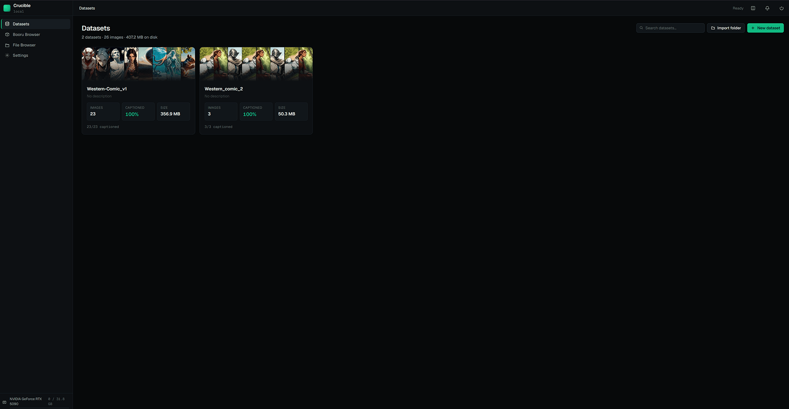
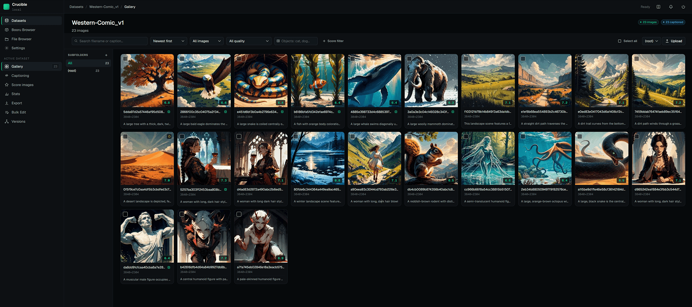
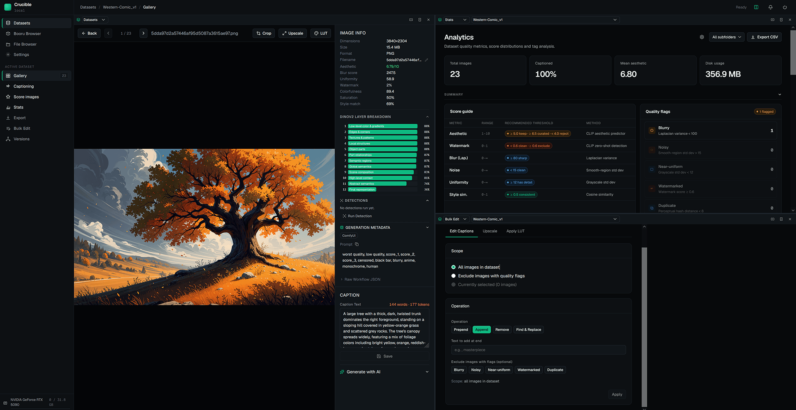

# Crucible

A local web-based application for building, curating, and exporting Stable Diffusion training datasets. Manage your image collections with AI-powered captioning, multi-metric quality scoring, and flexible export to the most common training formats.


## What it does

Crucible gives you a single interface to go from raw image folders to a clean, captioned, scored, and filtered training dataset ready to drop into Kohya SS, AI Toolkit, or any other training framework.

- **Import** images from local folders into named datasets
- **Caption** images in batch using local ML models (Ollama, Florence-2, PaliGemma-2)
- **Detect** objects and ground phrases in images using Florence-2 bounding-box detection
- **Process** images with ML upscaling and LUT color grading
- **Score** every image across aesthetic quality, technical quality, watermark detection, and style similarity
- **Filter & curate** via search, quality flags, and score ranges
- **Batch edit** captions, crops, and resizes across selected images
- **Version** datasets with named snapshots and branches — restore any prior state
- **Browse** your filesystem, preview generation metadata, and import directly into datasets
- **Look up** booru tags to build tag vocabularies for your training subjects
- **Export** to Kohya, AI Toolkit, or plain folder format with per-export filtering and resizing
- **Split view** — run any pages side-by-side in independently scrollable panes

All long-running operations (import, captioning, scoring, export) run in a background job queue and stream real-time progress to the UI via SSE.

▶ [Watch the showcase on YouTube](https://www.youtube.com/watch?v=Ig4j5ijovCI)





---

## Contents

- [Features](#features)
  - [Datasets & Gallery](#datasets--gallery)
  - [AI Captioning](#ai-captioning)
  - [Object Detection](#object-detection)
  - [Image Processing](#image-processing)
  - [Quality Scoring](#quality-scoring)
  - [Batch Operations](#batch-operations)
  - [Statistics Dashboard](#statistics-dashboard)
  - [Dataset Versioning](#dataset-versioning)
  - [Export](#export)
  - [File Browser](#file-browser)
  - [Settings](#settings)
  - [Booru Tag Lookup](#booru-tag-lookup)
  - [Split View](#split-view)
- [Prerequisites](#prerequisites)
- [Installation](#installation)
- [Usage](#usage)
- [Common Issues](#common-issues)
- [Tech Stack](#tech-stack)

---

## Features

### Datasets & Gallery
- Create multiple named datasets, each pointing to a folder of images
- Rename datasets — folder is moved on disk and all image paths are updated automatically
- Gallery view with search (filename or caption text), pagination, and sort
- Filter by caption status, quality flags, score ranges (multi-chip — add any number of field + min/max conditions combined as AND), aspect ratio, file size, format, and detected object label
- Drag-and-drop image files onto the gallery to add them to the dataset
- Organize images into subfolders (logical groupings — images stay flat on disk); move or copy images or entire subfolders to a different dataset in one operation
- Per-image detail view with metadata, caption editor, and crop/rotate tools
- **Generation Metadata** — PNG metadata from AUTOMATIC1111 and ComfyUI workflows is extracted at import and displayed per-image: prompt, negative prompt, model, sampler, steps, CFG scale, seed, VAE, size, and optional raw ComfyUI workflow JSON

### AI Captioning
Batch-caption any selection of images using one of three backends:

| Model | VRAM | Notes |
|---|---|---|
| **Ollama**  | varies | Points to a local Ollama instance on `localhost:11434` |
| **Florence-2** | ~5.5 GB | Styles: short, detailed, tags, dense, promptgen |
| **PaliGemma-2 3B** | ~6 GB | Requires HuggingFace token; styles: short, detailed, tags, booru |

Caption post-processing options:
- Strip common AI refusal phrases automatically
- Back up the original `.txt` sidecar before overwriting
- **Rename on caption** — after each caption is saved, rename the image file to `{subfolder_slug}_{NNN}.ext` (or `image_{NNN}.ext` for root images); useful for building consistently named datasets
- **Target resolution preprocessing** — when a target width/height is set, each image is center-cropped to that aspect ratio and scaled to that resolution *in memory* before being sent to the model; no files are written to disk

**Prompt Preset Manager** — save and reload named combinations of model, style, and custom prompt text so you can reproduce captioning runs without re-entering settings.

### Object Detection
Run Florence-2 bounding-box detection on any selection of images as a background job.

Two detection tasks:

| Task | Description |
|---|---|
| **Object Detection** (`<OD>`) | Fixed-vocabulary detection — finds categories the model was trained on, no prompt needed |
| **Phrase Grounding** (`<CAPTION_TO_PHRASE_GROUNDING>`) | Draws boxes around noun phrases in a text prompt; use "Use caption as prompt" to automatically ground each image's own caption |

Results are shown in the **DETECTIONS** panel on the Image Detail page:
- Label chips with per-label counts
- SVG overlay on the image with per-label colour coding
- Click any label chip to toggle its boxes on/off
- Eye icon in the toolbar hides/shows all boxes at once

Available from the **Detect** button in the SelectionToolbar, and from the Object Detection section on the Captioning page when a Florence-2 model is selected.

### Image Processing

#### Upscaling
ML-based image upscaling via the [`spandrel`](https://github.com/chaiNNer-org/spandrel) library, which auto-detects architecture from model files:
- Supported architectures: RealESRGAN/RRDB, SwinIR, HAT, OmniSR, and more (anything spandrel recognises)
- Place `.pth` or `.safetensors` model files in `models/upscale_models/` — or point `UPSCALE_MODELS_DIR=` in `.env` at an existing models folder
- Two output modes: **Replace** (overwrites source image, updates DB record) or **New file** (`{stem}_upNx{ext}`, creates a new DB record)
- Optional target width × height — upscales first, then resizes down to fit, preserving aspect ratio

Available from: the **Upscale** button in the ImageDetailPage toolbar, the **Upscale** modal in SelectionToolbar, and the **Upscale** tab on the Bulk Edit page.

#### LUT Color Grading
Apply 3D colour look-up tables (`.cube` or `.3dl`) to images:
- Adjustable blend intensity (0.0 – 1.0) — 0 = original, 1 = full LUT applied
- Place LUT files in `models/lut/` — or set `LUT_MODELS_DIR=` in `.env`
- Same **Replace** / **New file** output modes as upscaling

Available from: the **LUT** button in the ImageDetailPage toolbar (mutually exclusive with Crop and Upscale), the **LUT** modal in SelectionToolbar, and the **Apply LUT** tab on the Bulk Edit page.

#### Crop & Resize
- **Crop** — by default creates a new image record (non-destructive); toggle **Replace** to overwrite the source instead; choose aspect ratio, anchor point, and optional output pixel dimensions; supports atomic crop + upscale in one step
- **Resize** — downscale the longest side of selected images to a target pixel count (original untouched)

### Quality Scoring

| Scorer | Metrics | GPU |
|---|---|---|
| **Technical** | Blur (Laplacian variance), noise (smooth-region std dev), uniformity (grayscale std dev), color, saturation | CPU only |
| **Aesthetic** | Aesthetic score 1–10 (LAION Aesthetic Predictor v2.5), watermark score 0–1 (CLIP zero-shot), CLIP embeddings | ~3.5 GB VRAM |
| **DINOv2** | 768-dim final-layer embedding + all 12 transformer-layer CLS tokens for per-layer style analysis | ~1.2 GB VRAM |
| **Style Similarity** | Cosine similarity against reference images using stored embeddings | CPU only |
| **Duplicate Detection** | Perceptual hash (pHash) grouping | CPU only |

**Style similarity modes:**

| Mode | Description |
|---|---|
| `clip` | Cosine similarity of CLIP ViT-L-14 embeddings |
| `dino` | Cosine similarity of DINOv2 final-layer (or any of 12 layers) embeddings |
| `combined` | Weighted blend: 38% CLIP + 62% DINOv2 — best overall style consistency signal |
| `dino_all_layers` / `combined_all_layers` | Score each of the 12 DINOv2 layers independently and store all results |

Quality flags are set automatically when metrics cross thresholds (all configurable in [Settings](#settings)):

| Flag | Default threshold |
|---|---|
| `is_blurry` | Laplacian variance < 100 |
| `is_noisy` | Noise std dev > 15 |
| `is_uniform` | Grayscale std dev < 12 |
| `has_watermark` | CLIP watermark score ≥ 0.6 |
| `is_duplicate` | pHash Hamming distance < 8 vs another image in the dataset |

All five thresholds are configurable in [Settings](#settings) — changes take effect on the next scoring run.

The scoring run can be scoped to a specific subfolder via a dropdown in the Quality page header (shown only when subfolders exist), so you can score one subset at a time without touching the rest of the dataset.

### Batch Operations
Select any images in the gallery (or use **Space** while viewing an image in the detail view) to add them to the selection. Selections persist across dataset navigation — the selection toolbar and every action modal show a **per-dataset badge breakdown** so you can always see which datasets your selected images come from (images from a dataset other than the current one are highlighted in amber as a warning).

- **Batch caption** — run any captioning model on the selection with all the same options as the full-dataset run
- **Batch score** — run technical, aesthetic, watermark, and/or embedding scoring on the selection
- **Batch upscale** — upscale selected images using any installed upscale model (see [Image Processing](#image-processing))
- **Batch LUT** — apply a LUT to selected images with a chosen intensity (see [Image Processing](#image-processing))
- **Batch detect** — run Florence-2 object detection or phrase grounding on the selection
- **Batch crop** — crop selected images to a target aspect ratio (center, top-left, or custom anchor)
- **Batch resize** — resize the longest side of selected images to a target pixel count (downscale only)
- **Caption find-replace** — regex-capable search-and-replace across caption text for a whole dataset or a selection
- **Bulk delete** — remove selected images from the dataset and disk

### Statistics Dashboard
- 14+ interactive histograms: aesthetic, blur, noise, uniformity, color, saturation, watermark, megapixels, file size, aspect ratio, caption length, caption token distribution, style similarity, quality flags
  - **Caption token distribution** uses GPT-2 BPE tokenisation and highlights captions that exceed CLIP's 77-token truncation limit
- Editable histogram bucket edges — rebucketing runs entirely client-side against raw score arrays
- Top-500 tag frequency chart and tag co-occurrence matrix
- Click any histogram bar or quality flag card to open a filtered thumbnail grid
- A gear icon in the page header opens a settings drawer to toggle individual histogram panels on/off; visibility state is persisted per-browser
- All histograms and charts can be scoped to a specific subfolder via a dropdown in the page header

### Dataset Versioning
Snapshot-based version control for datasets — similar in concept to git commits.

**Three versioning modes** (configured in [Settings](#settings)):

| Mode | Behaviour |
|---|---|
| **Off** | Versioning disabled; all versioning endpoints return an error |
| **Manual** | Every snapshot eagerly copies all image files to a content-addressable object store (full point-in-time backup) |
| **Auto** | Snapshot records metadata only; files are copied lazily on first overwrite (copy-on-write) — storage only grows when you actually change an image |

In both Manual and Auto modes, image files are automatically backed up before deletion so that a pre-deletion snapshot can always be restored.

**Features:**
- **Snapshots** — create named, time-stamped checkpoints of a dataset with an optional description
- **Branches** — create named branches, each with its own independent snapshot history; switch branches and restore recent snapshots directly from the **sidebar accordion** (without navigating away), or use the full branch selector on the Versions page; delete any non-active branch (and all its snapshots) via the trash icon — the active branch must be switched away from before it can be deleted
- **Restore** — rewind the entire dataset to any prior snapshot (runs as a background job with a live progress bar); optionally auto-snapshot the current state first; the "Current" indicator moves to the restored snapshot on completion
- **Diff** — compare any two snapshots to see which images were added, removed, or modified (field-level changes)
- **Branch snapshot prompts** — configurable in Settings: prompt before checkout or branch creation (*Ask* mode) or always create snapshots automatically (*Auto* mode)

The object store lives at `{dataset_folder}/.versions/objects/` and is content-addressed — identical file content is stored only once regardless of how many snapshots reference it.

Access via the **Versions** sidebar item on any dataset page.

### Export
Three fully implemented export formats, all with identical filter and processing options:

| Format | Use case |
|---|---|
| **Kohya** | Kohya SS LoRA / full fine-tune training |
| **AI Toolkit** | AI Toolkit training |
| **Plain folder** | Any other framework (`images/` + `captions.jsonl` + `tags.csv`) |

Per-export options:
- Minimum aesthetic score filter
- Captioned-only filter
- Per-flag exclusions (blurry, noisy, uniform, watermarked, duplicate)
- Minimum style similarity filter
- Image format conversion (original / JPEG with quality setting)
- Resize longest side (downscale only)
- Caption sidecar format: `.txt`, `.caption`, or single `captions.jsonl`
- Subfolder scoping — export only images from a specific subfolder
- **Strip metadata** — forces a lossless PIL round-trip to discard embedded PNG text chunks (A1111 `parameters`, ComfyUI `workflow`/`prompt`, EXIF) even when no format conversion or resize is requested
- **Captions only** — skip image files entirely and export only caption sidecars / JSONL manifests; useful for updating captions in an existing dataset without re-copying images
- **Live export preview** — shows exact will-export and excluded counts (broken down by filter reason) before you run

### File Browser
A three-panel filesystem explorer built into the app:

- Left panel: drive roots + quick-access shortcut to the datasets folder
- Centre panel: breadcrumb navigation, sortable file list (name / size / date), images-only toggle, context menu (rename / delete / import into dataset)
- Right panel: image preview + dimensions/format/size metadata + generation metadata (A1111 / ComfyUI)
- Create folders, rename files and directories, delete items (syncs DB records automatically)
- Import any folder of images directly into an existing dataset without leaving the browser

### Settings
Route: `/settings` — accessible from the sidebar.

**Quality flag thresholds** — five configurable number inputs:

| Setting | Controls |
|---|---|
| Blur threshold | Laplacian variance cutoff for `is_blurry` (default 100) |
| Noise threshold | Smooth-region std dev cutoff for `is_noisy` (default 15) |
| Uniformity threshold | Grayscale std dev cutoff for `is_uniform` (default 12) |
| Watermark threshold | CLIP zero-shot score cutoff for `has_watermark` (default 0.6) |
| Duplicate threshold | pHash Hamming distance cutoff for `is_duplicate` (default 8) |

Changes take effect on the next scoring run — existing scored images are not automatically re-flagged.

**Versioning mode** — switch between Off, Manual, and Auto (see [Dataset Versioning](#dataset-versioning)).

**UI Behavior** — two browser-local preferences, each taking effect immediately without a Save button:
- Default-focused button in destructive confirmation dialogs: *Cancel* (safe default) or *Confirm* (faster workflows)
- Branch snapshot behavior: *Ask* (shows a prompt before checkout or branch creation, letting you choose whether to create a snapshot) or *Auto* (always creates snapshots without prompting)

### Booru Tag Lookup
Search booru image boards for tag vocabulary when building tag lists for your training subjects:

- Searches **Safebooru** (SFW) or **Gelbooru** (requires API key + user ID in `.env`)
- Shows tag name, category (character / artist / copyright / general / meta), and post count
- Configurable result limit (20 / 50 / 100); results cached for 5 minutes
- Copy individual tags or the full list to clipboard

### Split View
Split the main content area into two independently operating panes:

- Toggle via the **Columns** icon in the top-right toolbar
- Split any pane horizontally or vertically with the split buttons in the pane header, split panes can be split again
- Each pane has its own page selector and dataset selector — run Gallery in one pane and Stats in another, for example
- Drag the resize handle between panes to adjust the split ratio
- Close all panes to return to single-view

---

## Prerequisites

### Required
- **Python 3.10+**
- **Node.js 18+**

### For ML inference (captioning and aesthetic/DINOv2 scoring)
- **NVIDIA GPU with CUDA support**
- Minimum ~6 GB VRAM for a single captioning model; 8–12 GB recommended for comfortable use
- The technical scorer and duplicate detector run on CPU with no GPU requirement

### Optional
- **Ollama** installed and running locally (`localhost:11434`) to use Ollama-based captioning models
- **HuggingFace account** with a token (`HF_TOKEN`) to use PaliGemma-2 (requires accepting the model license at huggingface.co)
- **Gelbooru API key + user ID** for Gelbooru tag fetching (Safebooru works without a key)

---

## Supported Operating Systems

| OS | Status |
|---|---|
| Windows 10 / 11 | Fully supported (`manage.ps1`) |
| Linux / macOS | Fully supported (`manage.sh`) |

---

## Installation

```bash
# Clone the repository
git clone https://github.com/Blandmarrow/Crucible
```

### Windows

Double-click **`Crucible.bat`** and choose **Setup** from the menu to create the virtual environment, install all dependencies, and build the frontend.

You can also run it directly in PowerShell:

```powershell
.\manage.ps1 setup
```

### Linux / macOS

```bash
chmod +x manage.sh
./manage.sh setup
```

> **GPU inference note**: the venv is created with `--system-site-packages` so it inherits PyTorch from your system Python. If you need CUDA support, install PyTorch in your system Python first ([pytorch.org/get-started](https://pytorch.org/get-started/locally/)), then run `./manage.sh setup`. The technical scorer and duplicate detector run on CPU with no GPU requirement.

### Optional: API keys

The app works out of the box with no configuration. A `.env` file is only needed if you want to use PaliGemma-2 or Gelbooru. Copy `.env.example` to `.env` and fill in the values you need:

```env
HF_TOKEN=hf_...           # Required for PaliGemma-2 (accept the model license at huggingface.co first)
GELBOORU_API_KEY=...      # Optional — Gelbooru tag fetching (Safebooru works without a key)
GELBOORU_USER_ID=...
```

---

## Usage

### Windows

Double-click **`Crucible.bat`** and choose **Start** to launch the app on `http://localhost:8000`, or **Update** to pull the latest changes and rebuild.

Or run directly in PowerShell:

```powershell
.\manage.ps1 start    # production server on :8000
.\manage.ps1 update   # git pull + update deps + rebuild frontend
.\manage.ps1 dev      # backend hot-reload (:8000) + Vite dev server (:5173)
```

### Linux / macOS

```bash
./manage.sh start    # production server on :8000
./manage.sh update   # git pull + update deps + rebuild frontend
./manage.sh dev      # backend hot-reload (:8000) + Vite dev server (:5173)
```

To shut down, click the power icon in the top-right of the app and confirm, or press `Ctrl+C` in the terminal.

---

## Common Issues

### Changes not showing up / stale UI

If the app appears to be showing old data or not reflecting a recent change (wrong image counts, outdated captions, gallery not refreshing), the most likely cause is the browser serving a cached version of the frontend assets.

**Fix:** clear your browser cache for `localhost:8000`, or open the app in a private/incognito window. If the problem persists, do a hard refresh (`Ctrl+Shift+R` on Windows/Linux, `Cmd+Shift+R` on macOS).

---

## Tech Stack

**Backend:** Python · FastAPI · SQLAlchemy (async) · SQLite · Alembic · Pillow · OpenCV · PyTorch · Transformers · OpenCLIP · spandrel

**Frontend:** React 19 · TypeScript · Vite · TanStack Query · Zustand · Tailwind CSS · Recharts
